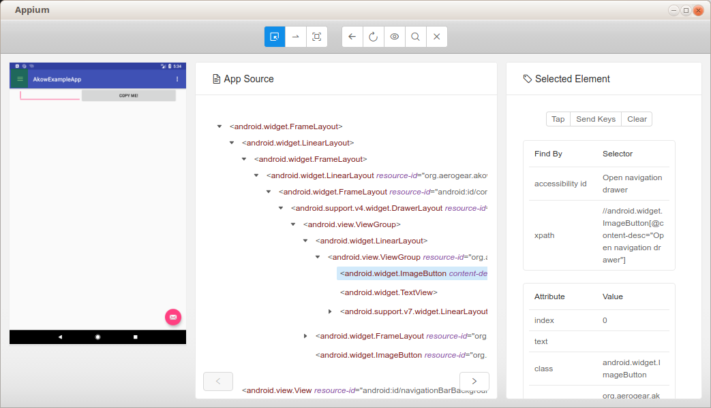

# akow - Kotlin wrapper for Appium
This library provides a way to write UI based tests especially for mobile platforms (Android and iOS).

It uses Kotlin based DSL (domain specific language) for writing tests without too much boilerplate in comparison with using Appium API directly. 
Also use of PageObject pattern makes tests easily maintainable and even multi-platform.

_NOTE: This is a very early development version, use with caution._

## PageObject pattern

This model separates the logic the presentation logic of the associated page objects and the test logic which leads to tests that are less likely to break by UI change, and would therefore increase 
the maintainability of the test suite.

Usually PageObject is associated with one "screen" user interacts with. On Android this is for example some Activity or Fragment.  

Logic for controlling the UI should be inside PageObject, however no assertions should be written there. Assetions belong to the test itself. 

### PageObject levels and use for multiple platforms 
PageObject pattern also allows you to write test logic without platform depedency. This is achieved by using two-levels of PageObjects.

 1. Interfaces extending [PageObject](lib/src/main/kotlin/org/aerogear/akow/pageobject/PageObject.kt), where you write platform-independent page object implementation.
 2. Class implementing interface from 1 and extending platform specific screen (e.g. [AndroidScreen](lib/src/main/kotlin/org/aerogear/akow/pageobject/AndroidScreen.kt)) to have actual implementation of finding
   `WebElement` and filling the page object.

Better it's shown with this picture:

_TBD_

## Checklist

Simply how to write your test using akow:

   1. From use-cases in your app (simply how your app works) determine what tests should do   
   2. Identify individual "screens" that take part in the use-cases
   3. Write PageObjects for them (level 1 page objects)
        * launch your app on the device and use [appium-desktop](https://github.com/appium/appium-desktop)
        * there is integrated *inspector* in the appium-desktop app, you can use it to investigate individual elements in the app
        * 
        * create new interface extending [PageObject](lib/src/main/kotlin/org/aerogear/akow/pageobject/PageObject.kt)
        * create properties in that interface for individual UI elements
        * implement logic in PageObject
        
        Example of such PageObject is in example interface [MainScreen](example-test/src/test/kotlin/pageobjects/MainScreen.kt):

```kotlin
interface MainScreen : PageObject {
    //UI elements definition
    val navDrawer: WebElement
    val mnuTextFieldsItem: WebElement
    //logic implementation
    fun selectInNavDrawer(item: WebElement) {
        navDrawer.click()
        item.click()
    }
}
```        
        
   4. Implement PageObjects for specific platform (level 2 page objects)
        * create class implementing PageObject you created in step 3 and platform specific abstract class such as[AndroidScreen](lib/src/main/kotlin/org/aerogear/akow/pageobject/AndroidScreen.kt)
        * implement properties for the individual UI elements - using delegated properties, e.g. `by id()` or `by accesibilityId()`
        
        Example of such implementation is in example class [MainAndroidScreen](example-test/src/test/kotlin/pageobjects/android/MainAndroidScreen.kt).

```kotlin
class MainAndroidScreen : AndroidScreen(), MainScreen {
    //UI elements retrieval implementation
    override val navDrawer by accessibilityId("Open navigation drawer")
    override val mnuTextFieldsItem by id("org.aerogear.akow.example:id/design_menu_item_text")
}
``` 
   5. Configure appium
        * appium is configured by call of function `appium()` that itself has separate DSL for configuring it, store the result in some global variable
        * add all `applications` that you want to test and configure devices for them by using `capabilities`
        * for each `application` (such as `androidApplication`) add `screens` section where you'll add all your instantiated page objects (of level 2)

        Example of such configuration in [init.kt](example-test/src/test/kotlin/init.kt): 
```kotlin
val appium = appium("http://localhost:4723/wd/hub") {
    applications { 
        androidApplication("org.aerogear.akow.example", ".MainActivity") {
            capabilities {
                //setting of DesiredCapabilities for Appium 
            }
            screens {
                +MainAndroidScreen()
                +TextFieldsAndroidScreen()
                //add all of your level 2 page objects here
            }
        }
        //you'll be able to add more platform specific applications here (in future)
    }
}
```     
_NOTE: Support for multiple applications is very much experimental._   
        
   6. Implement the tests 
        * tests need to be parametrized and `@RunWith(Parameterized::class)`
        * one parameter is passed into test and it's currently tested Application from that `appium` object, so you'll need add whole array of `application`s into the test
    
      This is usually done in kind of base abstract class and other tests are extending it:
      
```kotlin
        
        //appium is your configured object from step 5
        abstract class BaseTest : AkowTest(appium) {
            companion object {
                @Parameterized.Parameters(name = "{0}")
                @JvmStatic
                fun applications() = appium.applications.asList() 
            }
        
        }
```      
Use `akow()` function to access test context DSL in your function. Test can look like this [TextFieldsTest](example-test/src/test/kotlin/tests/TextfieldsTests.kt):

```kotlin
@RunWith(Parameterized::class)
class TextfieldsTests : BaseTest() {

    @Test
    fun copyMeTest() {
        akow {

            on<MainScreen> { //level 1 page object is used in context
                selectInNavDrawer(mnuTextFieldsItem)
            }

            on<TextFieldsScreen> {
                val toBeCopied = "Hello akow!"
                editText.click() //logic should be ideally somewhere in the page object, this is for demonstration 
                editText.sendKeys(toBeCopied)
                btCopyMe.click()
                assertEquals(toBeCopied, textField.text)
            }

        }
    }
}
```         


   7. Run the tests using gradle or your IDE
         * you can also arrange tests in [TestSuite](example-test/src/test/kotlin/TestSuite.kt)
                
   
## How to use  the library

It's JVM8 based library. It expects to use JUnit4 as test framework for running the test.

Gradle:
```
TBD
```    
  
  
